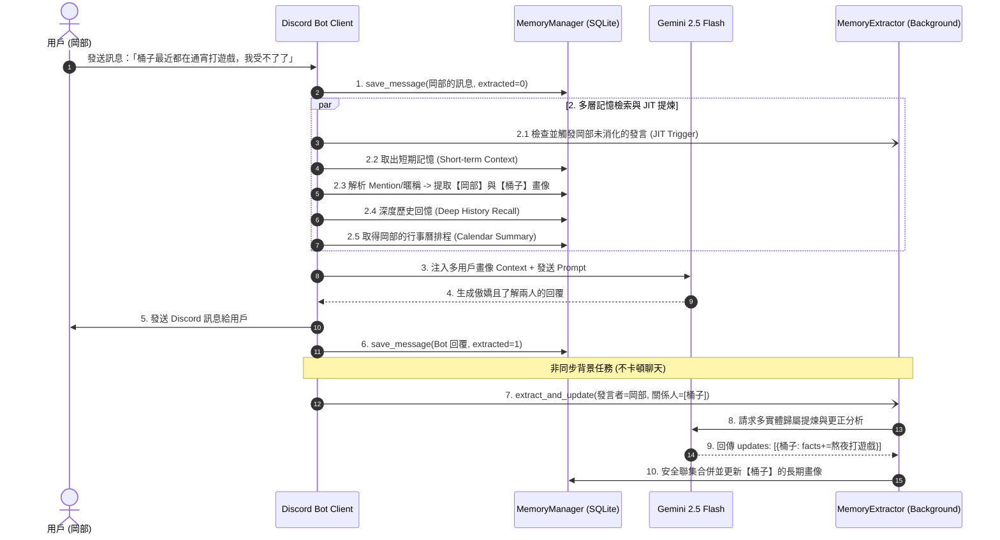

# Friend-Bot 多維立體記憶系統架構設計文件 (Memory System Design)

---

## 📖 1. 系統願景與設計哲學

傳統聊天機器人的記憶機制普遍存在三大痛點：
1. **單一發言者視角**：當發言者 A 在群組中提及群友 B 或討論 B 的事情時，機器人無法調閱 B 的記憶，甚至會把 B 的特徵錯誤記錄到 A 身上。
2. **記憶容易被覆蓋洗白**：當大語言模型（LLM）在日常對話中回傳空特徵時，傳統系統直接覆蓋舊記憶，導致累積已久的個人事實清空。
3. **監聽頻道即時提煉開銷巨大且缺乏脈絡**：單句提煉無法看懂跨越數分鐘的完整對話，且破碎的短句發言頻繁觸發 LLM API，浪費算力與配額。

**Friend-Bot 記憶系統** 透過 **「三層記憶分層架構」**、**「A+B+C 多人畫像檢索組合拳」**、**「多實體跨用戶提煉歸屬」**、**「歷史事實增量聯集與顯式更正機制」** 以及 **「監聽頻道批次累積與 JIT 按需統合提煉（方案 C）」**，打造出具備立體群聊社交認知、極致省資源、長期穩定且能持續自我進化的擬真群友記憶中樞。

---

## 🏛️ 2. 三層記憶分層體系架構 (Three-Tier Memory Architecture)

```
┌────────────────────────────────────────────────────────────────────────┐
│                        【Friend-Bot 記憶體系】                          │
├─────────────────┬───────────────────┬──────────────────────────────────┤
│ 記憶層級        │ 儲存載體與時效    │ 核心作用與應用場景               │
├─────────────────┼───────────────────┼──────────────────────────────────┤
│ 第 1 層         │ SQLite `messages` │ • 記錄當前頻道「最近 15 則訊息」 │
│ 短期對話記憶    │ (滑動窗口，數分鐘)│ • 維持即時話題上下文與連貫對答   │
├─────────────────┼───────────────────┼──────────────────────────────────┤
│ 第 2 層 🌟      │ SQLite            │ • 永久保存（跨天、跨重開機）     │
│ 用戶長期畫像    │ `user_profiles`   │ • 記錄客觀事實 (`facts`) 與      │
│ (User Profiles) │ (結構化永久保存)  │   主觀互動印象 (`notes`)         │
├─────────────────┼───────────────────┼──────────────────────────────────┤
│ 第 3 層         │ SQLite FTS5       │ • 記錄數月以前跨頻道海量歷史     │
│ 深度歷史檔案庫  │ `messages_fts`    │ • 依聊天關鍵字自動聯想歷史舊事   │
└─────────────────┴───────────────────┴──────────────────────────────────┘
```

---

## 🔍 3. 檢索端：多人多維記憶載入機制 (Multi-User Profile Recall)

當主頻道有人發言時，系統會啟動 **A + B + C 組合拳**，除了發言者本人外，額外提取最多 3 位在場/被提及的關係人群友畫像，注入至 Prompt 上下文中：

```
                           收到用戶發言
                                │
        ┌───────────────────────┼───────────────────────┐
        ▼                       ▼                       ▼
  【方案 A】              【方案 B】              【方案 C】
  顯式 Mention / 回覆     純文字暱稱掃描          近期在場活躍群友
  • 解析 @群友            • 快速比對群友別名庫    • 提取前 15 則訊息發言者
  • 解析 Reply 原作者     • 捕捉「桶子又通宵」    • 掌握當前聊天室在場者
        │                       │                       │
        └───────────────────────┼───────────────────────┘
                                ▼
                   去重並排除發言者本人與 Bot 自身
                                ▼
         批次載入多用戶畫像 (`get_user_profiles_batch`)
                                ▼
                 結構化組裝至 Prompt Context 供 LLM 回覆
```

---

## 👂 4. 監聽頻道改良方案 C：批次累積 ＋ JIT 按需統合提煉

為了解決純監聽頻道單句提煉導致的「API 浪費」與「脈絡破碎」問題，系統採用 **方案 C：混合智慧模式**：

```
                               監聽頻道訊息 (Listen Channel)
                                            │
                                            ▼
                           1. 即時存庫 (extracted = 0)
                                            │
               ┌────────────────────────────┴────────────────────────────┐
               ▼                                                         ▼
       【平日背景批次消化】                                      【主頻道有人發言時 JIT 優先消化】
       • 每累積滿 15 則 或 靜默 10 分鐘                          • 發言者若在監聽頻道有待處理發言
       • 打包多輪上下文給 Gemini 一次分析                        • 優先將其對話批次提煉更新畫像
               │                                                         │
               └────────────────────────────┬────────────────────────────┘
                                            ▼
                       【進入底層強制增量聯集管線】
                   - 既有事實 100% 完好保留
                   - 新事實追加 (Union)
                   - remove_facts 精準過濾
                   - 標記 extracted = 1
```

### 效益對比
- **API 消耗減少約 85%**：從 100 則訊息發起 100 次 API 呼叫，降至僅需 2~3 次多輪對話打包呼叫。
- **多輪語意理解**：能精準辨識跨數分鐘的前後文因果問答（如：A 詢問鍵盤型號，B 隔了兩分鐘回答）。

---

## 🧠 5. 提煉端：多實體跨用戶歸屬與防洗白保護

### 5.1 跨用戶特徵歸屬 (Cross-User Attribution)
當發言者提到其他群友時（如：*「桶子每天都在熬夜玩遊戲，我正在幫他縫衣服」*）：
- **發言者 (真由理)**：僅提煉自述特徵（`"正在縫製新服裝"`），發言者畫像不受污染。
- **被提及者 (桶子)**：精準提煉他人轉述特徵（`"每天熬夜玩遊戲"`）與社交印象（`"被真由理吐槽通宵"`），並正確寫入桶子的畫像中。

### 5.2 記憶防洗白與顯式自我更正 (`remove_facts`)
為了解決「LLM 偷懶給空列表導致歷史事實被洗白」與「用戶澄清事實卻無法刪除舊記憶」的矛盾，系統採用 **增量聯集 + 顯式移除過濾算法**：

```
                    Gemini 背景提煉 JSON
                              │
            ┌─────────────────┴─────────────────┐
            ▼                                   ▼
  📌 facts: ["目前定居在台北市"]        🗑️ remove_facts: ["住在台中市"]
            │                                   │
            └─────────────────┬─────────────────┘
                              ▼
            【後端安全合併算法 (Safe Merge & Remove)】:
            1. filtered_facts = 排除符合 remove_facts 的舊事實
            2. merged_facts = list(dict.fromkeys(filtered_facts + new_facts))
            3. 寫回 SQLite user_profiles 表
```

| 情境 | LLM 回傳內容 | 處理效果 |
| :--- | :--- | :--- |
| **日常純聊天** (無新事實) | `facts: []`, `remove_facts: []` | 🛡️ **歷史事實 100% 完整保留，絕不洗白** |
| **發現新特徵** (追加喜好) | `facts: ["愛玩法環"]`, `remove_facts: []` | ➕ **舊事實 + 新事實 自動聯集合併** |
| **用戶澄清更正** (推翻舊事) | `facts: ["定居台北"]`, `remove_facts: ["台中"]` | ✏️ **精準剔除「台中」，順利寫入「台北」** |

---

## 🗄️ 6. 資料庫結構設計 (SQLite Schema)

### 6.1 `messages` (第 1 層：對話歷史與提煉狀態)
```sql
CREATE TABLE IF NOT EXISTS messages (
    id INTEGER PRIMARY KEY AUTOINCREMENT,
    message_id TEXT UNIQUE,
    channel_id TEXT NOT NULL,
    user_id TEXT NOT NULL,
    user_name TEXT NOT NULL,
    content TEXT NOT NULL,
    has_image INTEGER DEFAULT 0,
    is_bot INTEGER DEFAULT 0,
    timestamp INTEGER NOT NULL,
    extracted INTEGER DEFAULT 0,       -- 0: 待提煉, 1: 已提煉完成
    created_at TIMESTAMP DEFAULT CURRENT_TIMESTAMP
);
```

### 6.2 `user_profiles` (第 2 層：用戶長期畫像表)
```sql
CREATE TABLE IF NOT EXISTS user_profiles (
    user_id TEXT PRIMARY KEY,          -- Discord User ID
    user_name TEXT NOT NULL,           -- 最新用戶顯示名稱
    facts TEXT DEFAULT '[]',           -- JSON Array: 客觀事實、喜好、特徵列表
    interaction_notes TEXT DEFAULT '', -- Text: 主觀互動印象、人際關係與評價
    updated_at TIMESTAMP DEFAULT CURRENT_TIMESTAMP
);
```

### 6.3 `messages_fts` (第 3 層：全文檢索索引)
```sql
CREATE VIRTUAL TABLE IF NOT EXISTS messages_fts USING fts5(
    content,
    user_name,
    channel_id UNINDEXED,
    msg_id UNINDEXED
);
```

---

## 🔄 7. 完整交互時序圖 (Interaction Sequence Flow)



---

## 🛠️ 8. 相關核心原始碼檔案導覽

| 模組檔案 | 主要職責與關鍵方法 |
| :--- | :--- |
| [`src/friend_bot/memory/memory_manager.py`](file:///C:/ALL%20FILES/Code/friend-bot/src/friend_bot/memory/memory_manager.py) | • `resolve_multi_user_profiles()`: A+B+C 多人畫像檢索組合拳<br>• `get_unextracted_messages()` / `mark_messages_extracted()`: 待處理訊息流轉<br>• `get_known_users_map()`: 群友別名索引庫 |
| [`src/friend_bot/ai/memory_extractor.py`](file:///C:/ALL%20FILES/Code/friend-bot/src/friend_bot/ai/memory_extractor.py) | • `extract_from_dialogue_batch()`: 監聽頻道多輪批次提煉<br>• `process_user_unextracted_messages()`: JIT 按需統合提煉<br>• `add_to_listen_queue()`: 監聽隊列 15 則/10 分鐘防抖調度 |
| [`src/friend_bot/ai/prompts.py`](file:///C:/ALL%20FILES/Code/friend-bot/src/friend_bot/ai/prompts.py) | • `build_batch_dialogue_extraction_prompt()`: 多輪對話全局分析 Prompt<br>• `build_multi_entity_extraction_prompt()`: 單次多實體提煉 Prompt |
| [`src/friend_bot/bot/client.py`](file:///C:/ALL%20FILES/Code/friend-bot/src/friend_bot/bot/client.py) | • 串接監聽頻道累積隊列與主對話 JIT 觸發 |
| [`test/tests_verify.py`](file:///C:/ALL%20FILES/Code/friend-bot/test/tests_verify.py) | • 9 項自動化單元測試（涵蓋多維檢索、跨用戶歸屬、防洗白、更正刪除、批次提煉） |
