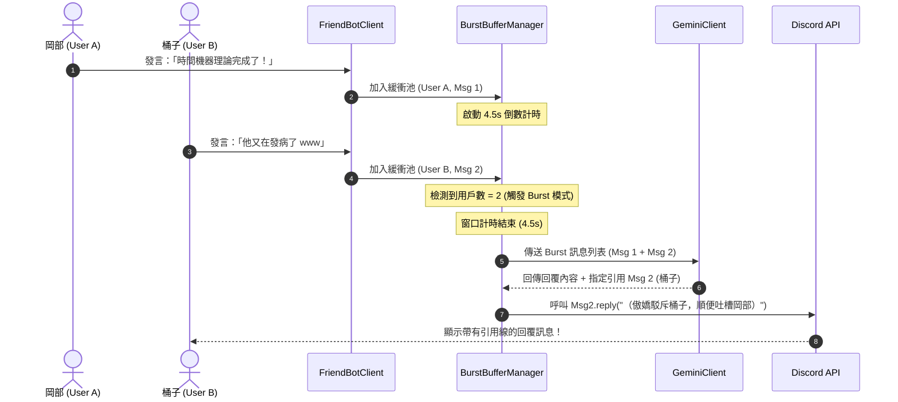

# 🎯 多人群聊短時熱絡 (Burst) 與動態引用回覆機制計畫書
*(Multi-User Burst Detection & Dynamic Reply Mechanism Plan)*

本文檔評估並設計 **Friend-Bot（牧瀨紅莉栖）** 在 Discord 群聊中，針對**「短時間內 2 人以上連續傳送訊息」**的情境，進行智慧彙整並以 **Discord 原生引用回覆（Reply with Reference）** 效果精準發送回應的完整系統架構與實作計畫。

---

## 💡 一、 需求背景與設計目標

### 1. 現狀痛點
- 目前機器人通常在收到一則訊息後即開始處理並發送回覆。
- 當群組處於「熱烈討論 / 多人搶話 / 吐槽爭論」時（例如 3~8 秒內 A、B、C 連續丟出訊息）：
  - 機器人若對每則訊息單獨反應，會造成「洗頻」或「前言不搭後語」。
  - 機器人若只以普通發言回覆，缺乏指向性，群友分不清紅莉栖這句話是在吐槽誰、回答誰。

### 2. 核心目標
當檢測到 **限定短時間窗口內（例如 4 ~ 8 秒）有多位不同群友（>= 2 人）連續發言** 時：
1. **聚合對話 (Burst Batching)**：暫緩幾秒收集多位群友的發言，整合為一次綜合情境理解。
2. **智慧決定引用目標 (Reply Target Selection)**：由紅莉栖判斷主要回覆或吐槽的核心對象（例如：提出關鍵問題者、發表荒謬言論被眾人吐槽者、或好感度最高/最親近者）。
3. **使用 Discord 原生 Reply 效果**：以 `target_message.reply(...)` 的形式發送回覆，畫面上會帶有 Discord 專屬的「引用回覆線與原文預覽」，極具臨場感。
4. **兼顧多人語境**：回覆內容既針對被引用者精準吐槽/作答，同時也能順帶吐槽或附和在場的其他群友。

---

## ⏱️ 二、 短時熱絡檢測機制 (Burst Detection & Window Engine)

### 1. 時間窗口與防抖收集模型 (Time-Window Sliding Buffer)
```
  群友 A 發言 ──┐ (t = 0s)
                ├─► 啟動短時熱絡窗口計時器 (例如 4 秒)
  群友 B 發言 ──┤ (t = 1.5s) ──► 檢測到發言人數 >= 2 人！標記為 Multi-User Burst
  群友 C 發言 ──┘ (t = 3.0s) ──► 更新最新訊息
                │
                ▼ (t = 4.0s 窗口截止)
        【進入 Burst 彙整生成與動態引用發送】
```

### 2. 參數規劃 (`config/config.yaml`)
可在設定檔中自由微調窗口與行為：
```yaml
chat_behavior:
  # 多人群聊短時熱絡 (Burst) 聚合設定
  burst_reply:
    enable_burst_reply: true
    # 短時收集窗口（秒）：在此時間內若有新訊息且有多人發言，則等待收集完成
    window_seconds: 4.5
    # 觸發 Burst 的最小不同用戶數門檻（預設 2 人）
    min_user_count: 2
    # 單次 Burst 最多收集的訊息數量上限（達到上限立即觸發，避免延遲過長）
    max_burst_messages: 5
```

---

## 🎯 三、 引用目標選擇策略 (Reply Target Selection)

當 2 人以上發言被打包送入 AI 處理時，系統需決定 **Discord 回覆引用（Reply）要綁定哪一則訊息**。

### 推薦：AI 語意決定 + 規則保底 (Hybrid Strategy)

| 優先級 | 選擇策略 | 運作邏輯 |
| :---: | :--- | :--- |
| **🥇 策略 A (AI 語意判斷 - 推薦)** | **由 Gemini 判斷主要回應對象** | 在 Prompt 中給予訊息列表與序號，讓紅莉栖自行決定這段話「最想回覆/吐槽誰的哪一則發言」，輸出 `reply_to_msg_id`。 |
| **🥈 策略 B (提問者/關鍵句優先)** | **語意問句 / 標註優先** | 若多人發言中包含問號（`？`、`?`）或 `@紅莉栖`，優先引用該發問訊息。 |
| **🥉 策略 C (最新關鍵發言保底)** | **最後一位發言者** | 若 AI 未指定或判定均等，保底引用短時間內最後一位群友的訊息。 |

---

## 🧠 四、 Prompt 與角色口吻引導設計

在多人群聊 Burst 情境下，Prompt 將明確告知紅莉栖這是一場多人即時交流：

```text
【系統指示：多人群聊短時熱烈討論情境】
剛才在短時間內有多位群友（{user_count} 人）連續發言：
- [訊息 1 (ID: 101)] 岡部: 「助手！未來的時間跳躍裝置完成了嗎？」
- [訊息 2 (ID: 102)] 桶子: 「岡部你又在中二了，紅莉栖氏剛才去買布丁了吧 www」
- [訊息 3 (ID: 103)] 真由理: 「嘟嘟嚕～紅莉栖最喜歡的 Dr Pepper 我買回來了唷！」

【你的任務】：
1. 綜合評估這段熱烈對話，選擇你要「主要引用回覆（Reply）」的訊息對象（輸出該訊息 ID）。
2. 生成自然、傲嬌、生動的群友回覆。既直接回應被引用者，又自然接住其他人的話（例如：先引用回覆桶子駁斥他沒買布丁，同時順便傲嬌感謝真由理買的 Dr Pepper，並吐槽岡部別叫你助手）。
```

---

## 🔄 五、 系統架構與流程時序圖



---

## ⚖️ 六、 方案評估與優缺點分析

| 維度 | 優點 (Pros) | 潛在挑戰與解決方案 (Cons & Solutions) |
| :--- | :--- | :--- |
| **擬真感** | • 極度擬真！像真人一樣在群聊熱絡時「看完整段話再一次回覆」，並用 Discord 引用指向特定人。<br>• 避免多人群聊時各回各的混亂感。 | **延遲感知**：<br>需等待 3~4.5 秒窗口。*解決方案：僅在多人連續發話時聚攏，單人發言仍保持即時響應。* |
| **互動深度** | • 能展現紅莉栖「眼觀四面」的聰慧與傲嬌（一邊引用回覆 A，一邊順手吐槽 B）。 | **衝突控制**：<br>需做好非同步 Lock 與任務取消，避免多線程同時發送重複訊息。 |
| **API 效率** | • 將原本可能的 2~3 次獨立 API 呼叫合併為 1 次，節省 Token 與 API 費用。 | **測試複雜度**：<br>需撰寫時間窗口模擬的非同步單元測試。 |

---

## 📅 七、 開發實作階段規劃 (Roadmap)

1. **模組建立 (`src/friend_bot/bot/utils/burst/`)**：
   - 實作 `BurstBufferManager`：管理各頻道的短時訊息隊列、計時器防抖、用戶計數判定。
2. **AI Prompt 與解析擴充 (`src/friend_bot/ai/prompts.py`)**：
   - 新增 `build_burst_dialogue_prompt`，支援輸出回覆內容與指定被引用的 `target_message_id`。
3. **Client 串接 (`src/friend_bot/bot/client.py`)**：
   - 在 `on_message` 中若啟用 Burst 則將訊息委託給 `BurstBufferManager` 處理；
   - 收到 AI 生成結果後，使用 `target_message.reply()` 發送。
4. **單元測試與驗證 (`test/tests_verify.py`)**：
   - 撰寫多人短時連發、目標訊息指定引用、單人發言不延遲等自動化測試。
