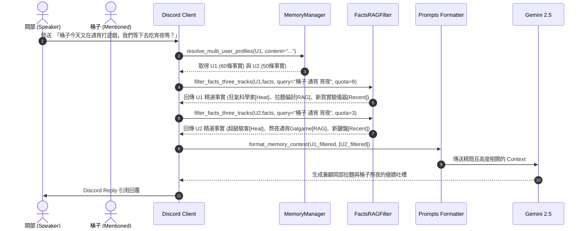

# 🧠 動態語義檢索（RAG）與多群友事實記憶管理架構設計書 (rag_mem.md)

---

## ▍1. 背景與核心痛點

在長期的 Discord 聊天互動中，系統會持續透過提煉器為每位群友累積 **客觀事實與喜好（Facts）**。雖然目前的增量聯集機制能保護事實不被覆蓋，但隨著使用時間增長，會面臨以下挑戰：

1. **Prompt 線性膨脹**：單個用戶若累積 50～100+ 條事實，全部注入 Prompt 會佔用過多 Context，增加推論成本與延遲。
2. **AI 注意力分散**：事實過多且大多與當前話題無關（例如聊遊戲時塞入了居住地、寵物、工作等無關特徵），容易稀釋 AI 的對話焦點。
3. **標誌性人設丟失**：若純粹依賴話題 RAG，在聊通用閒聊（如「早安」）時，若無關鍵字命中，可能會遺漏用戶最核心的標誌性人設（如「狂氣科學家」、「愛喝 Dr Pepper」）。
4. **多人群聊多實體干擾**：當頻道發生熱烈群聊（Burst）或提及多位群友時，若每位群友都全量注入事實，容易導致角色特徵混淆或超過單次對話長度。

---

## ▍2. 核心架構：三軌混合 RAG + 雙重熱度加權機制

為了處理解決上述問題，我們採用 **「資料庫全量沉澱，對話按需動態三軌召回」** 的設計：

```
                             【當前對話話題 Context / Burst 批次】
                                               │
                                               ▼
                              ┌──────────────────────────────────┐
                              │     構建語義檢索 Query 串       │
                              └──────────────────────────────────┘
                                               │
                       ┌───────────────────────┴───────────────────────┐
                       ▼                                               ▼
         【主要發言者 (Speaker)】                           【提及/在場群友 (Others)】
        (配額上限：6~8 條事實)                              (每人配額上限：2~3 條事實)
                       │                                               │
          ┌────────────┴────────────┐                     ┌────────────┴────────────┐
          ▼            ▼            ▼                     ▼            ▼            ▼
     [軌道 1: 熱度] [軌道 2: RAG] [軌道 3: 最新]     [軌道 1: 熱度] [軌道 2: RAG] [軌道 3: 最新]
     (高頻核心 2條) (話題匹配 4條) (時間倒序 2條)     (高頻核心 1條) (話題匹配 1條) (時間倒序 1條)
          │            │            │                     │            │            │
          └────────────┬────────────┘                     └────────────┬────────────┘
                       ▼                                               ▼
          [合併去重 ➔ Top-N 截斷]                           [合併去重 ➔ Top-N 截斷]
                       │                                               │
                       └───────────────────────┬───────────────────────┘
                                               ▼
                                   【注入 format_memory_context】
                                   （總事實量精準控制在 8~12 條）
                                               │
                                               ▼
                                      Gemini 生成精準回覆
```

---

## ▍3. 三軌檢索軌道與演算法設計

### 軌道 1：核心高頻特徵（Heat / Frequency Track，取 2~3 條）
* **演算法**：按每條事實的被使用次數（`hits`）由高到低排序，選取 Top-2 ~ Top-3。
* **效果**：確保用戶標誌性人設（如「狂氣科學家」、「愛喝 Dr Pepper」）即使當前沒被關鍵字命中，也能穩定常駐於紅莉栖的對話工作記憶中。

### 軌道 2：話題相關性檢索（Topic RAG Track，取 3~4 條）
* **演算法**：
  1. 對當前對話進行輕量化正規化、英文名詞提取與中文 2-gram/3-gram 滑動分詞。
  2. 過濾高頻日常停用詞（Stopwords）。
  3. 比對事實文本並計算匹配度得分，取得分最高的 Top-3 ~ Top-4。
* **效果**：在聊到拉麵、遊戲、求職、科技等特定話題時，精準喚醒對應記憶。

### 軌道 3：最新近況事實（Recent Track，取 2~3 條）
* **演算法**：依據事實的建立時間（`created_at`）倒序，取最新加入的 2~3 條。
* **效果**：保證最近發生的生活動態（如「新買了鍵盤」、「換了新工作」）始終被紅莉栖記住，能適時進行主動關心。

---

## ▍4. 雙重熱度加權機制 (Hybrid Heat Accumulation)

為了讓事實的熱度（`hits`）既能反映**日常聊天的活躍度**，又能精準沉澱**用戶的核心人格**，系統採用「雙重加權」機制：

```
                    ┌────────────────────────┐
                    │ 使用者在 Discord 發言  │
                    └───────────┬────────────┘
                                │
        ┌───────────────────────┴───────────────────────┐
        ▼ (即時線上對話)                                 ▼ (背景非同步提煉)
┌───────────────────────────────┐               ┌───────────────────────────────┐
│  【維度 1：檢索命中累加 (+1)】 │               │  【維度 2：提煉重複確認 (+3)】│
│                               │               │                               │
│ 當前話題觸發了 RAG 命中       │               │ AI 分析發言，發現用戶         │
│ ➔ 該事實被選入 Prompt         │               │ 「再次主動展現/提及該特徵」   │
│ ➔ `hits += 1`                 │               │ ➔ `hits += 3`                 │
│ (冷卻機制：同事實1小時限+1)    │               │ (權重更高，沉澱核心人設)      │
└───────────────────────────────┘               └───────────────────────────────┘
```

1. **維度 1（日常對話 RAG 命中加權）**：
   - 當某條事實因當前話題匹配被選入 Prompt 時，`hits += 1`。
   - **冷卻保護**：設置冷卻時間（如 1 小時內同條事實最多加 1 次），避免連續幾句同一話題導致計數暴增。
2. **維度 2（背景提煉重複確認加權）**：
   - 當背景提煉任務（單人 JIT / 監聽頻道批次）再次提取到既有事實時，賦予更高權重 `hits += 3`。
   - 代表該特徵是用戶反覆強調或展現的重要特質（如反覆自稱狂氣科學家、天天熬夜）。

---

## ▍5. 多人情境與提及他人（Multi-User & Mention）隔離流程

在多人群聊或發言中提及其他群友時，確保各用戶記憶**獨立檢索、隔離封裝**：



---

## ▍6. 模組調整清單與介面設計

### 1. [`src/friend_bot/memory/memory_manager.py`](file:///C:/ALL%20FILES/Code/friend-bot/src/friend_bot/memory/memory_manager.py)
靜態輔助方法：
```python
@staticmethod
def filter_facts_three_tracks(
    facts_data: List[Any],
    query_text: str = "",
    max_total: int = 8,
    heat_limit: int = 2,
    recent_limit: int = 2
) -> Tuple[List[str], List[str]]:
    """
    三軌混合篩選：
    1. 軌道 1 (Heat): 命中熱度最高事實 Top-heat_limit
    2. 軌道 3 (Recent): 最新事實 Top-recent_limit
    3. 軌道 2 (Topic RAG): 關鍵字匹配最高事實 Top-(max_total - heat - recent)
    4. 合併去重並保持在 max_total 條以內
    回傳: (注入 Prompt 的事實字串清單, 本次被 RAG 命中的事實清單)
    """
```

### 2. [`src/friend_bot/ai/prompts.py`](file:///C:/ALL%20FILES/Code/friend-bot/src/friend_bot/ai/prompts.py)
在 `format_memory_context` 支援三軌動態事實注入，確保每位群友事實精簡且具備核心熱度。

### 3. 指令相容性保證
- **`/kurisu-profile` 指令**：為維持卡片排版精簡舒適，若事實超過 7 則，精選展示 **Top-4 高熱度核心事實 + 隨機抽樣 3 則其他事實**（共 7 則，並標註總事實數量），避免卡片過於冗長；若 <= 7 則則全數展示。
- **日常聊天與 Burst**：全面套用三軌篩選，確保 Prompt 輕量且焦點集中。

---

## ▍7. 預期效益

| 指標 | 原機制（全量注入） | 三軌混合 RAG 機制 | 效益提升 |
| :--- | :--- | :--- | :--- |
| **Prompt Token 負載** | 隨歷史無限線性增加 | **恆定可控**（約 100~250 Tokens） | 節省 60%~80% 冗餘 Token |
| **人設穩定性** | 易被無關事實沖淡 | **核心熱門事實永遠常駐** | 保持立體鮮明的角色印象 |
| **話題響應精準度** | 事實過多容易抓錯話題 | **精準鎖定當前話題** | 大幅提升接梗與吐槽品質 |
| **多人群聊承載力** | 4 人以上易超出上限 | **主從分級配額**，輕鬆支援 5+ 人在場 | 徹底解決多人記憶混淆 |
| **長期歷史容量** | 擔心 Prompt 爆掉而受限 | **資料庫可無上限記錄數百條事實** | 實現真正的永久長期記憶 |

---

## ▍8. 最終 Prompt 完整架構剖析 (Final Prompt Architecture)

在完成 **「三軌 RAG 事實篩選」**、**「結構化多維度印象（核心性格 / 社交關係 / 近期動態）」** 與 **「動態好感度階級注入」** 後，傳送給 Gemini 的最終 Prompt 架構如下分為三大區塊：

```
┌────────────────────────────────────────────────────────────────────────┐
│ 1. 系統指令層 (System Instruction)                                     │
│    • 牧瀨紅莉栖人設與傲嬌風格                                           │
│    • 當前系統真實時間 (Current Time)                                    │
│    • 多人社交認知與群友默契指引                                         │
│    • 聯網搜尋 (search_web) 與行事曆工具規範                             │
├────────────────────────────────────────────────────────────────────────┤
│ 2. 記憶上下文層 (Memory Context - 由 format_memory_context 產生)       │
│                                                                        │
│  【主要發言者 (Speaker) 的個人特徵記憶】:                              │
│    - 【對此用戶態度 (Tier 1~4 傲嬌態度動態指令)】                       │
│    - 已知特徵/喜好: [經三軌 RAG 篩選後的 6~8 條精華事實 (Heat+RAG+Recent)]│
│    - 互動印象與習慣:                                                   │
│      【核心性格】長期穩定人格特質                                       │
│      【社交關係】對群友與紅莉栖的互動模式與默契                          │
│      【近期動態】近期生活焦點、情緒或話題動向                            │
│                                                                        │
│  【對話中提及 / 近期在場的其他群友畫像】 (最多 3~4 位):                │
│    - 用戶名稱: 桶子 (關係階級: familiar)                               │
│      • 【對此用戶態度 (Tier 2 熟識群友)】                              │
│      • 已知特徵: [經三軌 RAG 篩選後的 2~3 條精華事實]                   │
│      • 互動印象: 【核心性格】... 【社交關係】... 【近期動態】...         │
│                                                                        │
│  【用戶已登記的行事曆與排程 (Calendar Schedules)】 (若有)              │
│    - 當日與近期的日程清單與 Webhook 推送設定                            │
│                                                                        │
│  【過去的歷史話題回憶 (Deep History Recall)】 (若有)                   │
│    - FTS5 全文檢索召回的跨頻道相似話題歷史片段                         │
│                                                                        │
│  【近期頻道對話紀錄 (Short-term Context)】                             │
│    - 本頻道最近 10~15 則對話紀錄 (含發言者、是否附帶圖片)               │
├────────────────────────────────────────────────────────────────────────┤
│ 3. 當前對話觸發層 (Dialogue Trigger - 依場景切換)                      │
│                                                                        │
│  [場景 A：單人日常對話]                                                │
│    【當前用戶最新發言】: 岡部: 今晚要不要一起去吃拉麵？                │
│    請以幽默風趣的群友風格回應 岡部：                                   │
│                                                                        │
│  [場景 B：多人群聊短時熱絡 (Burst 聚合)]                               │
│    【💬 多人群聊即時熱烈討論 (短時間內有多位群友連續發言)】:            │
│    1. [ID: 101] 岡部: 桶子今天又在通宵打遊戲！                         │
│    2. [ID: 102] 桶子: 哪有，我是在編譯程式碼好嗎！                    │
│    3. [ID: 103] 岡部: 明明就是 Galgame！                               │
│    【回覆指導原則】：開頭必須標記 [TARGET_ID: 訊息ID]，兼顧多人語境    │
│                                                                        │
│  [場景 C：/kurisu-search 強制聯網搜尋]                                 │
│    【當前用戶最新發言】: 岡部: 【用戶明確要求強制聯網搜尋】：台北天氣   │
│    【特別指示】：務必調用 search_web 並具體整理新聞與實質內容           │
└────────────────────────────────────────────────────────────────────────┘
```

---

## ▍9. 全域設定檔（config.yaml）配置說明

在 [`config/config.yaml`](file:///C:/ALL%20FILES/Code/friend-bot/config/config.yaml) 中，所有三軌檢索配額、冷卻時間與加權增量皆可直接調整：

```yaml
memory:
  # 第 1 層 (短期記憶)：送入 Prompt 的最近頻道對話訊息數量
  short_term_history_limit: 15
  
  # 第 2 層 (長期畫像)：是否開啟背景自動分析對話並提取/更新用戶特徵
  enable_auto_memory_extraction: true
  
  # 【三軌事實記憶檢索 (3-Track Fact RAG & Heat) 設定】
  facts_rag:
    # 主要發言者 (Speaker) 事實配額設定
    speaker_max_total: 8      # 主要發言者最多帶入的事實總數
    speaker_heat_limit: 2     # 軌道 1：核心高頻事實數量上限
    speaker_recent_limit: 2   # 軌道 3：最新近況事實數量上限
    
    # 在場 / 被提及其他群友 (In-context / Others) 事實配額設定
    others_max_total: 3       # 每位其他群友最多帶入的事實總數
    others_heat_limit: 1      # 軌道 1：核心高頻事實數量上限
    others_recent_limit: 1    # 軌道 3：最新近況事實數量上限
    
    # 雙重熱度加權與防刷設定
    rag_hit_cooldown_seconds: 3600  # 即時對話 RAG 命中加權冷卻時間（秒，預設 1 小時）
    extraction_reaffirm_bonus: 3    # 背景提煉重複確認事實之熱度加權增量 (hits += N)
    rag_hit_bonus: 1                # 即時對話話題命中事實之熱度加權增量 (hits += N)

  # 第 3 層 (深層歷史回憶)：是否在檢測到話題或回憶觸發時自動檢索過去歷史對話
  enable_history_recall: true
  history_recall_limit: 4
```
